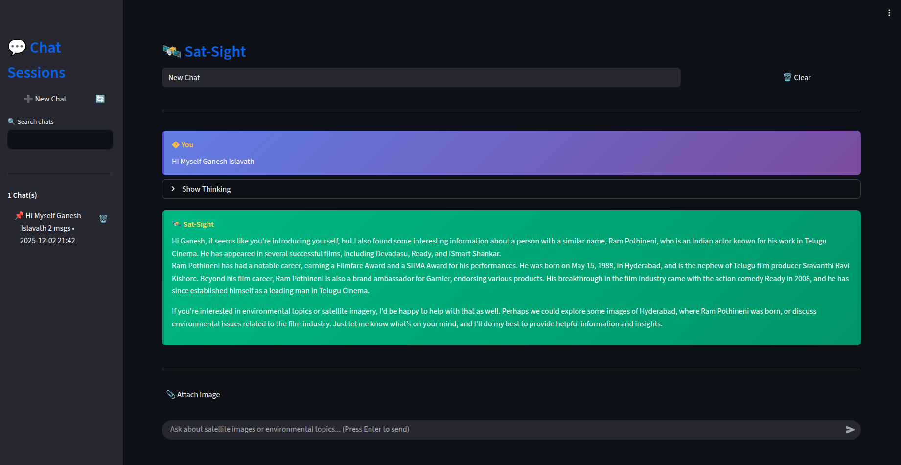

# Sat-Sight: Multi-Agent Satellite Imagery Analysis System

<!-- Project Banner - Add your image here -->



[](https://www.python.org/downloads/)
[](https://github.com/langchain-ai/langgraph)

## 🌍 Overview

Sat-Sight is an advanced multi-agent system for intelligent satellite imagery analysis and question-answering. Leveraging state-of-the-art AI technologies including LangGraph orchestration, CLIP embeddings, and specialized retrieval agents, Sat-Sight provides comprehensive answers to complex queries about satellite imagery, environmental monitoring, and geospatial analysis.

**Live Demo**: [http://10.32.38.102:8501/](http://10.32.38.102:8501/)  
*Note: Accessible only over the IISc network*

---

## ✨ Key Features

- **13 Specialized AI Agents**: Including reasoning, vision analysis, web search, and domain-specific retrieval agents
- **Multi-Modal Analysis**: Process both text queries and satellite imagery
- **Advanced Memory System**: Three-layer memory architecture (short-term, long-term, episodic)
- **Vector Search**: FAISS for 20K+ satellite images, ChromaDB for text documents
- **Interactive Web UI**: Streamlit-based interface with multi-session chat support
- **Flexible LLM Backend**: Support for both Groq API and local models
- **Real-Time Processing**: Async workflow execution with state management

---

## 🏗️ Architecture

Sat-Sight employs a sophisticated multi-agent architecture orchestrated by LangGraph:

```
User Query → Router Agent → Specialized Agents → Reasoning Agent → Response
                ↓
         [Vision, Web, Wikipedia, Weather, etc.]
                ↓
         Memory Agent (Context Storage)
```

### Core Components

- **Orchestration Layer**: LangGraph-based state machine for agent coordination
- **Agent Layer**: 13 specialized agents for different tasks
- **Retrieval Layer**: FAISS + ChromaDB for efficient similarity search
- **Memory Layer**: Persistent storage of interactions and context
- **UI Layer**: Streamlit web interface with session management

---

## 🚀 Quick Start

### Prerequisites

- Python 3.10 or higher
- CUDA-compatible GPU (recommended, 8GB+ VRAM)
- Conda or virtual environment
- Internet connection for API access

### Installation

1. **Clone the repository**
   ```bash
   git clone https://github.com/blacknirchinblade/sat_sight.git
   cd sat_sight
   ```

2. **Create and activate environment**
   ```bash
   conda create -n genaienv python=3.10
   conda activate genaienv
   ```

3. **Install dependencies**
   ```bash
   pip install -r requirements.txt
   ```

4. **Set up environment variables**
   ```bash
   cp .env.example .env
   # Edit .env and add your API keys:
   # - GROQ_API_KEY
   # - SEARCH_API_KEY (optional, for web search)
   ```

5. **Run the application**
   ```bash
   ./run_ui.sh
   ```

The web interface will be available at `http://localhost:8501`

---

## 📚 Usage

### Web Interface

1. Launch the Streamlit UI using `./run_ui.sh`
2. Create a new chat session or select an existing one
3. Enter your query or upload satellite imagery
4. Receive comprehensive AI-generated responses with relevant image results

### Example Queries

- "What are the environmental impacts of deforestation in the Amazon?"
- "Analyze this satellite image for urban development patterns"
- "Compare agricultural land use in India vs. USA"
- "What weather patterns affect California wildfires?"

### Workflow Usage

```python
from sat_sight.core.workflow import create_workflow

# Initialize workflow
workflow = create_workflow()

# Process query
result = workflow.invoke({
    "messages": [{"role": "user", "content": "Your query here"}]
})

print(result["messages"][-1]["content"])
```

---

## 🎯 Agent Capabilities

| Agent | Function | Data Source |
|-------|----------|-------------|
| **Router** | Query classification and routing | N/A |
| **Reasoning** | Final response generation with citations | All agents |
| **Vision** | Satellite image analysis using CLIP | FAISS (20K images) |
| **Web Search** | Real-time information retrieval | Serper API |
| **Wikipedia** | Geographic and general knowledge | Wikipedia API |
| **Weather** | Climate and meteorological data | ChromaDB |
| **Geographic** | Terrain and landform information | ChromaDB |
| **Agriculture** | Farming and crop analysis | ChromaDB |
| **Urban** | City planning and development | ChromaDB |
| **Environmental** | Ecology and conservation | ChromaDB |
| **Disaster** | Natural disaster analysis | ChromaDB |
| **Ocean** | Marine and coastal studies | ChromaDB |
| **Memory** | Conversation history and context | SQLite |

---

## 🔧 Configuration

### Environment Variables

Create a `.env` file in the project root:

```env
# Required
GROQ_API_KEY=your_groq_api_key_here

# Optional
SERPER_API_KEY=your_serper_api_key_here
LOCAL_LLM_PATH=models/llama-2-7b-chat.gguf
USE_LOCAL_LLM=false
```

### Model Configuration

Edit `sat_sight/core/config.py` to customize:
- LLM model selection
- Temperature and generation parameters
- Retrieval settings (top_k, similarity threshold)
- Memory retention policies

---

## 📁 Project Structure

```
sat_sight/
├── agents/              # Specialized agent implementations
├── core/                # Workflow orchestration and configuration
├── models/              # LLM wrappers and model management
├── retrieval/           # Vector stores and similarity search
├── memory/              # Conversation and context storage
├── tools/               # External API integrations
├── ui/                  # Streamlit web interface
├── utils/               # Helper functions and utilities
├── requirements.txt     # Python dependencies
├── run_ui.sh           # Launch script for web interface
└── README.md           # This file
```

---

## 🎥 Demo

<!-- Video Placeholder - Add your demo video here -->


[▶️ Watch Demo Video](docs/videos/demo.mp4)

---

## 👥 Contributors

This project was developed at the **Indian Institute of Science (IISc), Bangalore**.

- **Ganesh Islavath** - [gaenshi@iisc.ac.in](mailto:gaenshi@iisc.ac.in) | [GitHub](https://github.com/blacknirchinblade)
- **Rajiv Poorna** - [rajivpoorna@iisc.ac.in](mailto:rajivpoorna@iisc.ac.in)
- **Suraj Sai Praneeth** - [surajs@iisc.ac.in](mailto:surajs@iisc.ac.in)
- **Bhookya Raju** - [bhookyaraju@iisc.ac.in](mailto:bhookyaraju@iisc.ac.in)

For general inquiries: [ganeshnaik214@gmail.com](mailto:ganeshnaik214@gmail.com)

---

## 🙏 Acknowledgments

- Indian Institute of Science (IISc), Bangalore
- LangChain and LangGraph communities
- OpenAI CLIP model
- Groq API for fast inference
- The open-source community

---

## 📞 Support

For issues, questions, or suggestions:
- Open an issue on [GitHub](https://github.com/blacknirchinblade/sat_sight/issues)
- Contact the development team via email
- Check our Report for detailed guides

---

**Note**: Additional documentation will be added to the repository soon.

*Built with ❤️ at IISc Bangalore*
